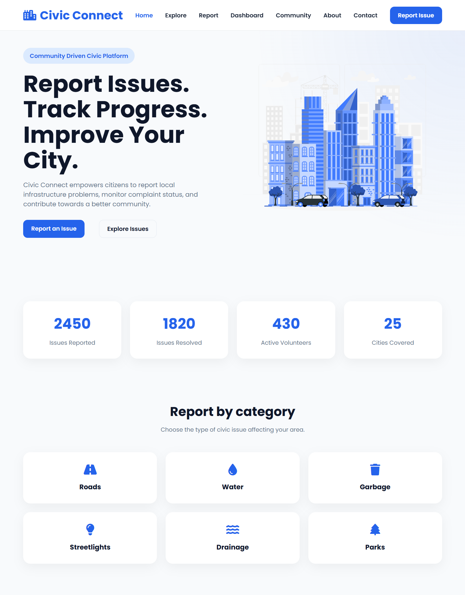
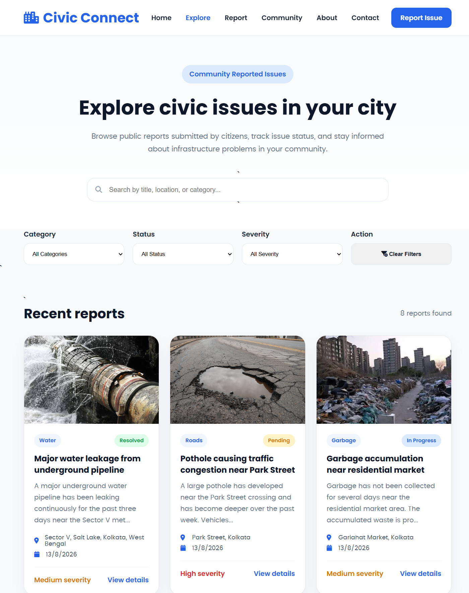
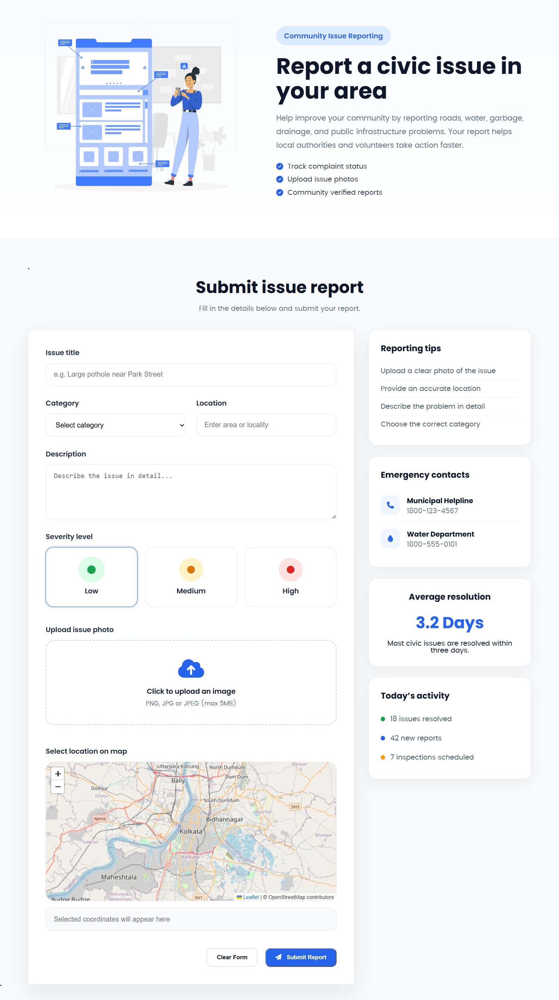
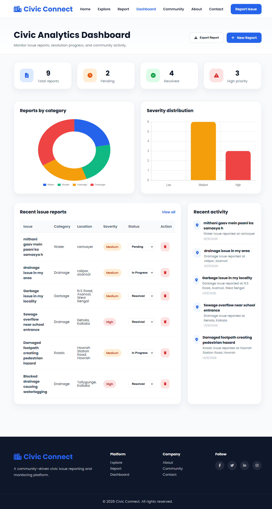
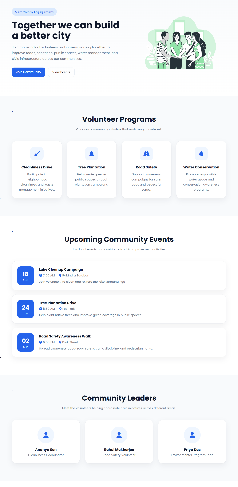
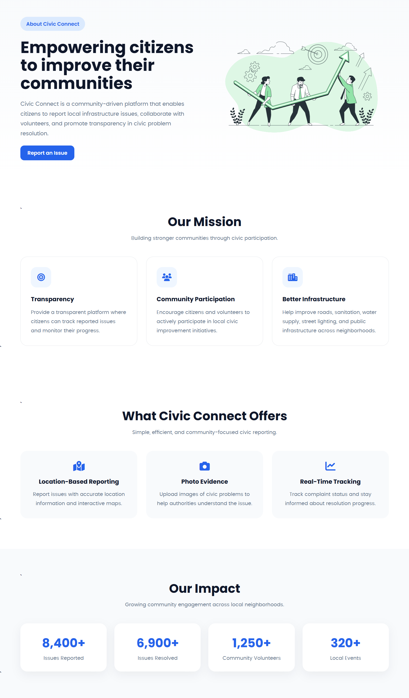
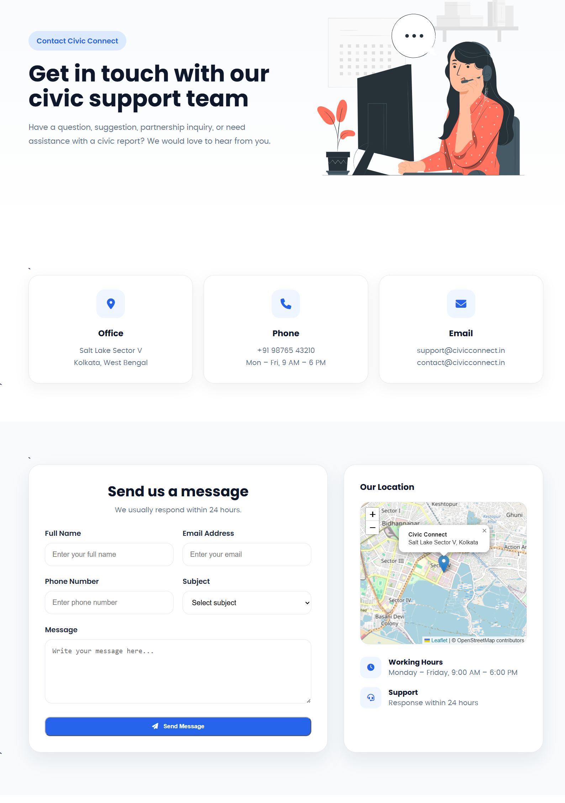
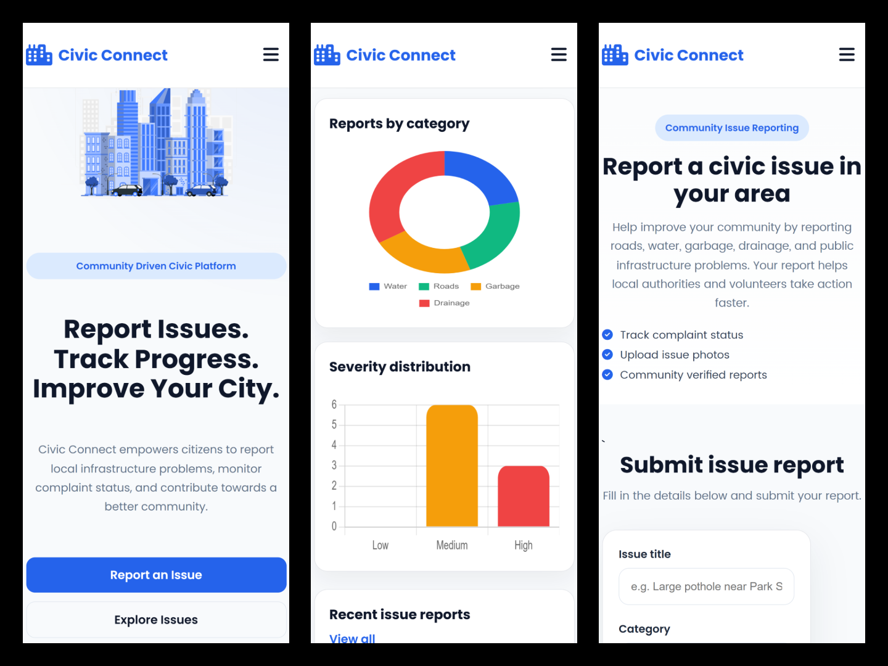

# 🏙️ Civic Connect

### A modern civic issue reporting and community engagement platform

Civic Connect is a responsive, multi-page web platform designed to help citizens **report local infrastructure problems, explore community issues, track report status, and visualize civic data through an interactive analytics dashboard.**

Built with **HTML5, CSS3, and JavaScript**, the project focuses on a clean user experience, responsive design, interactive data visualization, and browser-based data persistence.

---

## ✨ Features

### 📝 Civic Issue Reporting

- Submit infrastructure and public-service issues.
- Capture issue title, category, location, severity, description, and other relevant information.
- Store submitted reports using browser LocalStorage.

### 🔎 Issue Search & Filtering

- Search reports by title, location, or category.
- Filter issues by:
  - Category
  - Status
  - Severity

- Clear all filters with a single action.

### 🗺️ Interactive City Map

- Interactive map powered by **Leaflet.js**.
- Visualize reported civic issues across different locations.
- Location-based representation of reported problems.

### 📊 Analytics Dashboard

- Total reports
- Pending reports
- Resolved reports
- High-priority reports
- Reports by category
- Severity distribution
- Recent issue reports
- Recent community activity

### 🔄 Issue Status Management

- Update issue status directly from the dashboard.
- Supported statuses:
  - Pending
  - In Progress
  - Resolved

### 🗑️ Report Management

- Delete reports from the dashboard.
- Dashboard statistics and charts update according to stored data.

### 📥 Report Export

- Export stored civic reports as a JSON file.

### 👥 Community Engagement

- Community-focused programs and initiatives.
- Events and activities.
- Community leaders and impact information.
- Join-community section and testimonials.

### 📱 Responsive Design

- Mobile-friendly interface.
- Responsive navigation with mobile menu.
- Optimized cards, forms, charts, tables, and sections for smaller screens.
- Consistent responsive experience across the entire website.

### 🎨 Modern UI

- Clean blue-and-white visual system.
- Modern cards and badges.
- Smooth hover interactions.
- Consistent typography and spacing.
- Dedicated layouts for each major page.

---

## 📄 Pages

| Page             | Description                                                              |
| ---------------- | ------------------------------------------------------------------------ |
| 🏠 **Home**      | Introduction, statistics, categories, recent reports and interactive map |
| 🔍 **Explore**   | Search, filter and browse reported civic issues                          |
| 📝 **Report**    | Submit a new civic issue                                                 |
| 📊 **Dashboard** | View analytics, reports, charts and community activity                   |
| 👥 **Community** | Explore community programs, events, leaders and impact                   |
| ℹ️ **About**     | Learn about Civic Connect, its mission, features and values              |
| 📞 **Contact**   | Contact and communication section                                        |

---

## 🛠️ Tech Stack

### Frontend

- **HTML5**
- **CSS3**
- **JavaScript (ES6)**

### Libraries & Tools

- **Leaflet.js** — Interactive maps
- **Chart.js** — Dashboard data visualization
- **Font Awesome** — Icons
- **Google Fonts** — Typography

### Browser Storage

- **LocalStorage** — Client-side report persistence

---

## 📊 Dashboard

The Civic Connect dashboard provides a centralized view of the platform's civic data.

### Statistics

- Total Reports
- Pending Reports
- Resolved Reports
- High Priority Reports

### Visualizations

- Reports by Category
- Severity Distribution

### Report Management

- View recent reports
- Change issue status
- Delete reports
- Export report data

### Activity Tracking

- Displays recent issue activity based on submitted reports.

---

## 💾 Data Persistence

Civic Connect uses the browser's **LocalStorage API** to maintain report data.

When a user submits an issue, the report is stored locally in the browser and can subsequently be:

- Displayed on the Explore page
- Included in dashboard statistics
- Represented in charts
- Updated through status controls
- Deleted when required
- Exported as JSON

> **Note:** Since the current implementation uses Local Storage, the data is stored locally in the user's browser and is not synchronized between different devices or users.

---

## 📸 Screenshots

### 🏠 Home Page


>>>>>>> 93aedb3 (Updated-2  project README)

The landing page introduces Civic Connect with a clear call-to-action, civic statistics, issue categories, recent reports and an interactive city map.

---

### 🔍 Explore Issues



Browse reported civic issues using search and category, status and severity filters.

---

### 📝 Report an Issue



Citizens can submit infrastructure and public-service issues through the reporting form.

---

### 📊 Analytics Dashboard



View report statistics, charts, recent reports, status controls and community activity.

---

### 👥 Community



Explore community programs, events, leaders, impact and engagement opportunities.

---

### ℹ️ About Us



Learn about Civic Connect's mission, core values, reporting process and impact on local communities.

---

### 📞 Contact



Get in touch with the Civic Connect support team through contact information, a message form and an interactive location map.

---

### 📱 Mobile Responsive UI



Civic Connect is optimized for mobile devices with a responsive navigation system and mobile-friendly layouts.

> **Screenshot paths can be updated after adding the final screenshots to the repository.**

---

## 📁 Project Structure

```text
civic-connect/
│
├── index.html
├── explore.html
├── report.html
├── dashboard.html
├── community.html
├── about.html
├── contact.html
│
├── css/
│   ├── style.css
│   ├── responsive.css
│   ├── explore.css
│   ├── report.css
│   ├── dashboard.css
│   ├── community.css
│   ├── about.css
│   └── contact.css
│
├── js/
│   ├── main.js
│   ├── explore.js
│   ├── report.js
│   ├── dashboard.js
│   └── ...
│
├── assets/
│   └── images/
│
└── README.md
```

---

## 🚀 Getting Started

### 1. Clone the repository

```bash
git clone https://github.com/Prince2276/civic-connect.git
```

### 2. Open the project

```bash
cd civic-connect
```

### 3. Run the project

The project does not require a backend server.

You can open `index.html` directly in a browser or use **VS Code Live Server** for a better development experience.

### Using Live Server

1. Open the project in Visual Studio Code.
2. Install the **Live Server** extension if needed.
3. Right-click `index.html`.
4. Select **Open with Live Server**.
5. The Civic Connect website will open in your browser.

---

## 🔄 Application Flow

```text
                 ┌─────────────────┐
                 │   Civic Connect │
                 └────────┬────────┘
                          │
          ┌───────────────┼────────────────┐
          │               │                │
          ▼               ▼                ▼
      Report Issue      Explore         Community
          │               │
          ▼               ▼
      LocalStorage     Search / Filter
          │               │
          └───────┬───────┘
                  │
                  ▼
             Dashboard
                  │
        ┌─────────┼─────────┐
        ▼         ▼         ▼
      Stats     Charts    Reports
                           │
                    ┌──────┴──────┐
                    ▼             ▼
                Update Status   Delete
```

---

## 🎯 Project Goals

Civic Connect was developed with the following goals:

- Make civic issue reporting simple and accessible.
- Provide citizens with visibility into reported issues.
- Organize civic reports through categories, statuses and severity levels.
- Provide useful visual analytics through an interactive dashboard.
- Encourage community participation.
- Create a responsive and modern civic platform experience.

---

## 🔮 Future Enhancements

The current project is a frontend-focused implementation. Possible future improvements include:

- 🔐 User authentication and authorization
- 🗄️ Backend API integration
- 🛢️ Database integration
- 👨‍💼 Dedicated administrator dashboard
- ☁️ Cloud image storage
- 📧 Email notifications
- 🔔 Real-time status notifications
- 📍 Advanced geolocation support
- 🏛️ Integration with municipal/government systems
- 👥 Multi-user and role-based access
- 📱 Progressive Web App support

---

## ⚠️ Current Limitations

- Report data currently uses browser LocalStorage.
- Data is device/browser-specific.
- There is no centralized backend database.
- Authentication is not currently implemented.
- Export functionality currently generates JSON data.

These limitations can be addressed through future backend and cloud integration.

---

## 🌐 Live Demo

🚧 **Coming Soon**

The live version will be added after deployment.

---

## 👨‍💻 Author

### Prince Burnwal

B.Tech Computer Science & Engineering Student

**GitHub:**
https://github.com/Prince2276

---

## ⭐ If You Like This Project

If you find Civic Connect useful or interesting, consider giving the repository a ⭐ on GitHub.

---

### Built with ❤️ using HTML, CSS & JavaScript
